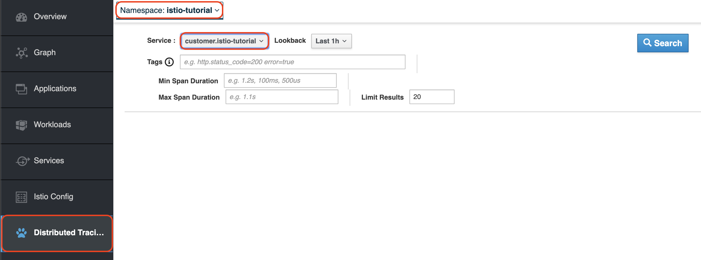
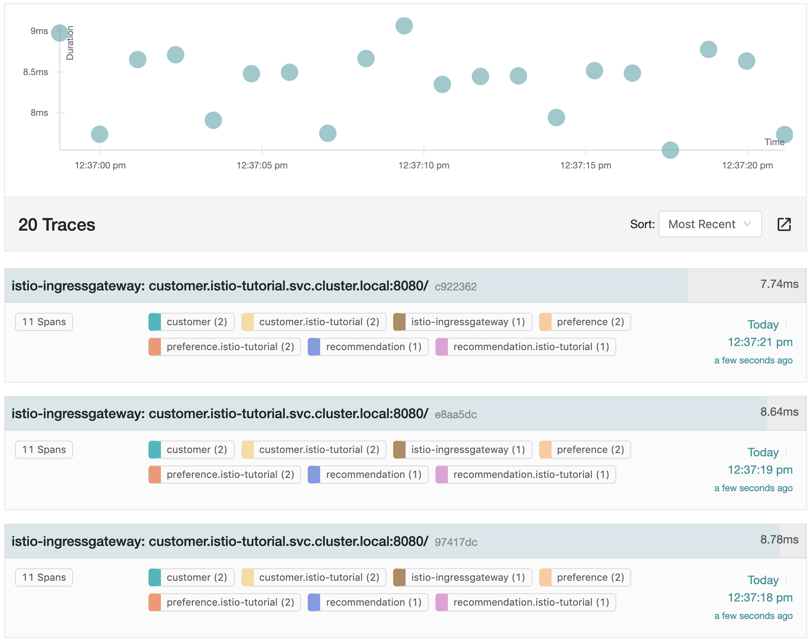
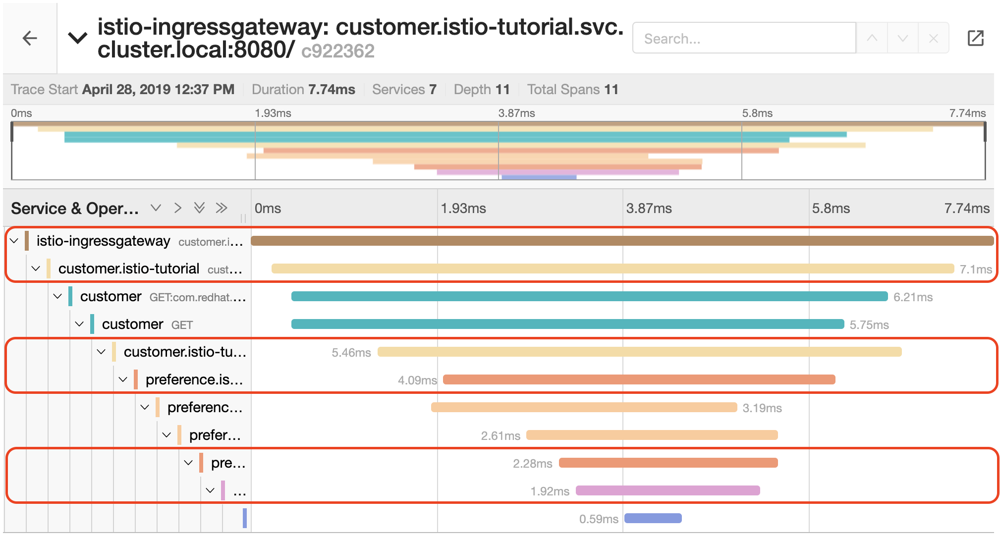
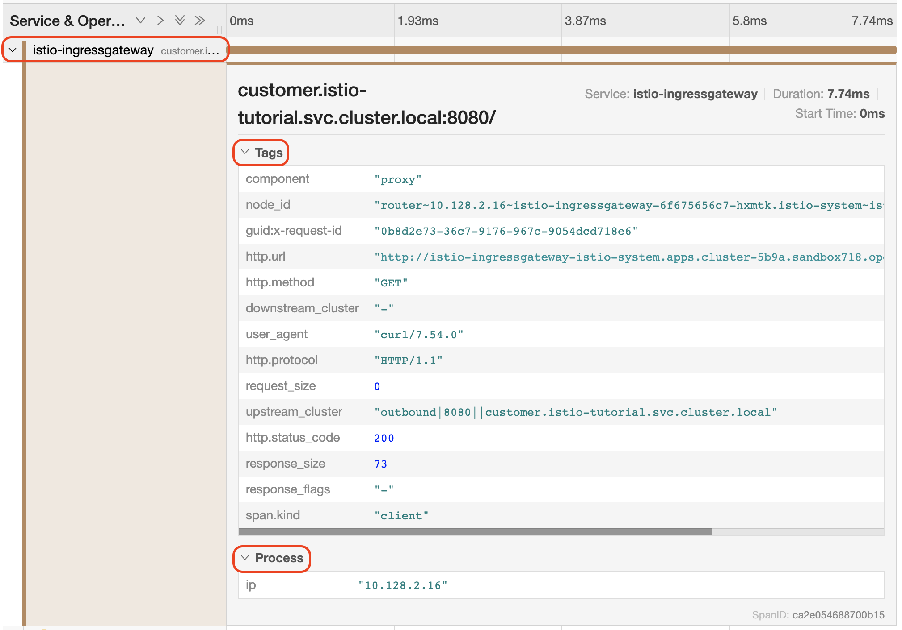

# Observing the Service Mesh using Kiali

Applications deployed within the Service Mesh are able to take advantage of the builtin tracing and monitoring features present in the control plane.  These features provide an invaluable insight into the organisation and operation of the application as well as the application's performance.

## What we will learn in this module

This module will provide a brief introduction to the kiali observability component within the Service Mesh control plane.

## Kiali

[Kiali](http://kiali.io) is a component which visualises an application's topology, health, metrics and tracing information to provide a deeper understanding of the application's behaviour and performance.  Within a single view it is easy to determine which services are communicating with each other, where the traffic is flowing, information about the current health of the service and other useful metrics.

Kiali also integrates with Jaeger to provide access to distributed tracing information, allowing you to track an individual request as it flows through the system and identify potential issues.

### How does Kiali work?

Every pod deployed as part of the Service Mesh contains a proxy container responsible for intercepting the application traffic coming into and going out of the pod.  The Service Mesh proxy is automatically created on deployment of the application and automatically captures information as part of each service invocation.  Kiali uses this information to provide a visualisation of the Service Mesh behaviour.  The information includes metrics as well as distributed tracing information.

### Generating load

Before we take a look at the Kiali console lets first generate some load on the Service Mesh.  From within a new terminal enter the following commands
`export INGRESS_GATEWAY=$(oc get route -n istio-system istio-ingressgateway -o 'jsonpath={.spec.host}')`

`while : ; do curl http://${INGRESS_GATEWAY}/ ; sleep 1 ; done`

### Opening the Kiali console

To open the kiali console enter the following command within a new terminal

`xdg-open https://$(oc get route -n istio-system kiali -o 'jsonpath={.spec.host}')`

When prompted to login use the username *admin* and the password *admin*.

### Kiali's Graph

Within the Kiali UI select the *Graph* option from the left hand navigation and then choose

* Namespace: istio-tutorial
* Versioned app graph
* Requests percentage
* Last 1m
* Every 10s

You should now see the application graph showing traffic being created by our script generating load.  The traffic will flow from the Service Mesh ingress gateway to the customer service, preference service and finally the recommendation service.  The request percentage will show *100%* on each edge except within the recommendation service where the traffic should be split evenly across all three versions.

### Kiali's Distributed Tracing

Within the Kiali UI select the *Distributed Tracing* option from the left hand navigation and then choose

* Namespace: istio-tutorial
* Service: customer.istio-tutorial

and finally press the *Search* button.

You should now see a list of the 20 most recent invocations of the customer service.

Select one of the invocations to see more information.  The graph should now show a hierarchy of the invocations with those spans highlighted in *red* automatically captured by the Service Mesh proxy, both client and server side, and the remainder provided by the application.

Each span can be expanded to show more contextual information captured as part of the tracing.

### Cleaning up

Switch back to the terminal with the script we used to generate load and press the ctrl+c keys to terminate the script.

## What we learned in this module

Kiali is a very useful tool for visualising the behaviour of your Service Mesh.  Through one UI you not only have a consistent view of your service interactions but you can see more detailed information about those invocations helping you to understand and identify potential issues which may arise.

With an understanding of Kiali you should now be able to make use of its capabilities within the following modules to visualise the changes in behaviour we will make through the resources within the Service Mesh framework.  Please keep you Kiali UI open as you work through the following modules.

Kiali provides additional capabilties beyond what we have explored in this module, for more information refer to the [Kiali website](http://kiali.io).

## Next module

You are now ready for the next module, proceed to ....
